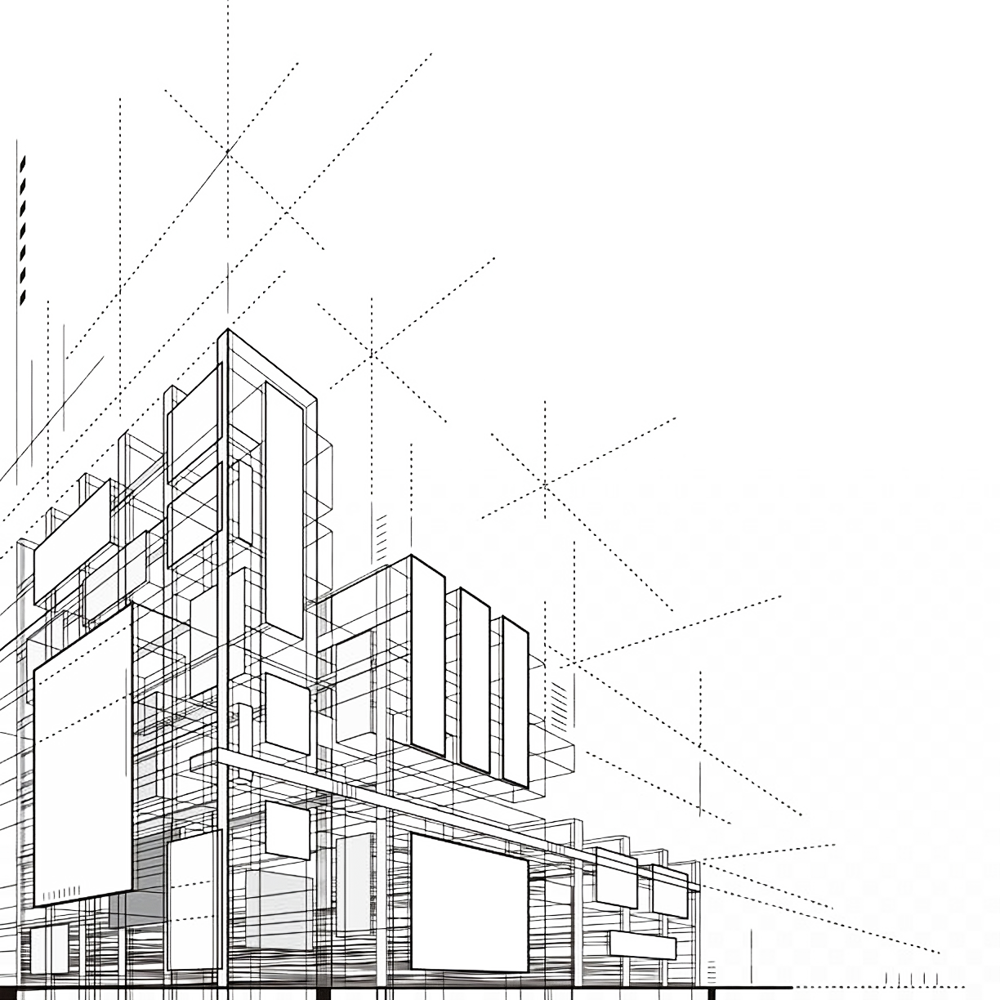

```{r setup, include=FALSE}
knitr::opts_chunk$set(echo = FALSE)
```

<div style="text-align: justify;">
Hola! Mi nombre es Anyelén Giraudo. Soy Arquitecta por la Facultad de Arquitectura, Diseño y Urbanismo de la Universidad Nacional del Litoral y estudiante de la Maestría en Economía Urbana en la Universidad Torcuato Di Tella. Actualmente trabajo en OdA, una Oficina de Arquitectura de la Ciudad de Santa Fe.
</div>

